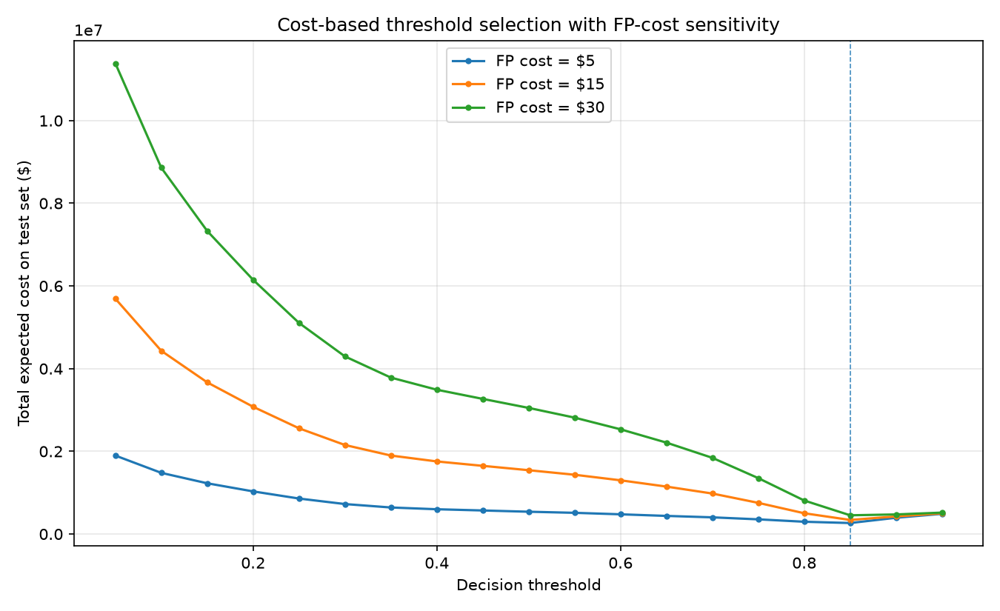

# Fraud Detection with Cost-Based Threshold Optimization

End-to-end fraud detection pipeline on 1.85M simulated credit-card
transactions ([Kaggle: kartik2112/fraud-detection](https://www.kaggle.com/datasets/kartik2112/fraud-detection),
generated with Sparkov). The focus is not the model itself but the
**business decision layer**: a fraud score only becomes a decision through
a threshold, and choosing that threshold is a cost trade-off problem —
a missed fraud costs the transaction amount, while a false alarm costs
analyst review time and customer friction.

## Results (555,719 out-of-time test transactions)

| Metric | Value | Context |
|---|---|---|
| PR-AUC | **0.233** | no-skill baseline = fraud rate 0.0039 → **~60x lift** |
| ROC-AUC | 0.916 | secondary metric |
| Optimal threshold | **0.85** (at FP cost = $15) | vs. arbitrary default 0.5 |
| Total expected cost | $340,904 vs. $1,543,839 at threshold 0.5 | **77.9% cost reduction** |
| Sensitivity | optimum stays at **0.85** across FP cost = $5 / $15 / $30 | conclusion robust to the assumption |



## Pipeline

1. **`01_eda.py` — SQL-first EDA (DuckDB).** Five queries establishing
   class imbalance (~0.5% fraud), amount skew, overnight fraud
   concentration, category risk, and customer-to-merchant distance.
   Every finding maps to exactly one feature downstream.
2. **`02_features_model.py` — Features + logistic regression baseline.**
   log(amt), hour / is_night, haversine distance, age, city population,
   category one-hots. `class_weight='balanced'` for imbalance; trained on
   `fraudTrain`, evaluated on `fraudTest` (chronological split =
   out-of-time validation). Primary metric: PR-AUC.
3. **`03_cost_threshold.py` — Cost-based threshold selection.**
   Cost(FN) = actual transaction amount lost; Cost(FP) = $15 review +
   friction estimate. Sweeps thresholds, minimizes total expected cost,
   and stress-tests the FP-cost assumption at $5 / $15 / $30.

## Key design decisions

**Why logistic regression first, not XGBoost?** Interpretability —
in regulated risk settings, model risk management needs explainable
decisions; a fast, interpretable baseline also makes any future model's
lift measurable rather than assumed.

**Why `class_weight='balanced'` instead of SMOTE?** Class weights
rebalance inside the loss function without manufacturing synthetic
samples. The real business lever is the decision threshold, which this
project handles explicitly in the cost layer.

**Why PR-AUC?** At a 0.4% fraud rate, accuracy and ROC-AUC are inflated
by the majority class. PR-AUC measures precision/recall on fraud calls —
what the business actually cares about — with a no-skill baseline equal
to the fraud rate.

**Why sensitivity analysis on FP cost?** The $15 figure is a business
estimate, not a fact. Showing that the optimal threshold does not move
across a 6x range of assumptions makes the recommendation robust.

## Limitations & roadmap

- Precision at the optimal threshold is 14% (recall 58%) — expected for
  a linear baseline. Next step: **XGBoost + per-card velocity features**
  (transaction counts in trailing windows), evaluated on the same cost
  framework so improvement is measured in dollars.
- FP cost is a point estimate; ideally calibrated with operations data.
- Simulated data lacks adversarial adaptation; the roadmap ends with a
  **PSI-based drift monitoring dashboard**.

## How to run

```bash
pip install pandas scikit-learn duckdb matplotlib
# Download fraudTrain.csv / fraudTest.csv from Kaggle into data/
python 01_eda.py
python 02_features_model.py
python 03_cost_threshold.py
```
